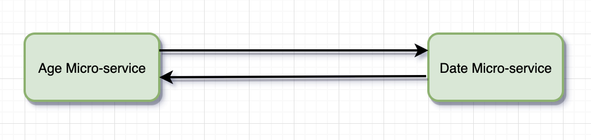
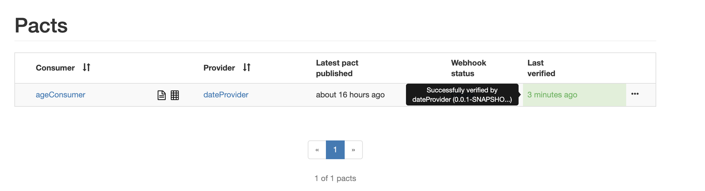

# Contract Testing Boilerplate

Contract Testing Boilerplate has two microservices developed using Spring Boot in a maven multi-module project.

  - Date Provider MicroService - /provider/validDate - Validates whether given date is a valid date or not
  - Age Consumer MicroService - /age-calculate - Returns age of a person based on given date
  
  


Start Date Provider MicroService by default runs in port 8080: 

```shell script
mvn spring-boot:run -pl date-provider
```

Start Age Consumer MicroService by default runs in port 8081: 

```shell script
mvn spring-boot:run -pl age-consumer
```


## What is Contract Testing?
An integration contract test is a test at the boundary of an external service verifying that it meets the contract expected by a consuming service.


## What is PACT?
Pact is a contract testing tool. Contract testing is a way to ensure that services (such as an API provider and a client) can communicate with each other. Without contract testing, the only way to know that services can communicate is by using expensive and brittle integration tests.

### Run Consumer contract Tests
```shell script
mvn clean test -pl age-consumer
```

Generated Pact file:
```json
{
  "provider": {
    "name": "dateProvider"
  },
  "consumer": {
    "name": "ageConsumer"
  },
  "interactions": [
    {
      "description": "valid date from provider",
      "request": {
        "method": "GET",
        "path": "/provider/validDate",
        "query": {
          "date": [
            "2001-02-03"
          ]
        },
        "matchingRules": {
          "query": {
            "date": {
              "matchers": [
                {
                  "match": "date",
                  "date": "2001-02-03"
                }
              ],
              "combine": "AND"
            }
          }
        },
        "generators": {
          "body": {
            "date": {
              "type": "Date",
              "format": "2001-02-03"
            }
          }
        }
      },
      "response": {
        "status": 200,
        "headers": {
          "content-type": "application/json",
          "Content-Type": "application/json; charset=UTF-8"
        },
        "body": {
          "month": 8,
          "year": 2000,
          "isValidDate": true,
          "day": 3
        },
        "matchingRules": {
          "body": {
            "$.year": {
              "matchers": [
                {
                  "match": "number"
                }
              ],
              "combine": "AND"
            },
            "$.month": {
              "matchers": [
                {
                  "match": "number"
                }
              ],
              "combine": "AND"
            },
            "$.day": {
              "matchers": [
                {
                  "match": "number"
                }
              ],
              "combine": "AND"
            },
            "$.isValidDate": {
              "matchers": [
                {
                  "match": "type"
                }
              ],
              "combine": "AND"
            }
          },
          "header": {
            "Content-Type": {
              "matchers": [
                {
                  "match": "regex",
                  "regex": "application/json(;\\s?charset=[\\w\\-]+)?"
                }
              ],
              "combine": "AND"
            }
          }
        }
      },
      "providerStates": [
        {
          "name": ""
        }
      ]
    }
  ],
  "metadata": {
    "pactSpecification": {
      "version": "3.0.0"
    },
    "pact-jvm": {
      "version": "4.0.9"
    }
  }
}
```

### Start Pact Broker at default port `:82`
```dockerfile
docker-compose up -d
```

### Publish Pact Files in Pact Broker
```shell script
$ cd age-consumer
$ mvn pact:publish
```

### Verify Pacts in Pact Broker at Provider side
```shell script
mvn clean -Dtest=PactAgeProviderTest test -pl date-provider
```



